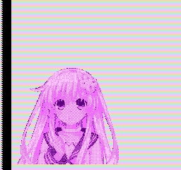

# HBlankPalette  

A small demo of NES that transfers pallets for each H-Blank.  

## Assemble  

Assemble using nesasm.  

```shell
nesasm Main.asm
```

[build.bat](build.bat) is available for windows.  

## Cartridge  

Burn to NROM or MMC3 cartridge.  
Modify the [`Mapper` definition](Main.asm) as necessary to assemble it.  

## Comparison  

<table style="text-align:center">
	<tr>
		<th>Real machine<br>Board:HVC-CPU-GPM-02<br>PPU:RP2C02G</th>
		<th>BizHawk 2.4 NesHawk</th>
		<th>FCEUX 2.2.3 New PPU</th>
		<th>FCEUX 2.2.3 Old PPU</th>
	</tr>
	<tr>
		<td></td>
		<td></td>
		<td></td>
		<td></td>
	</tr>
	<tr>
		<th>Mesen 0.9.9</th>
		<th>Nestopia UE 1.49</th>
		<th>puNES 0.105</th>
		<th>VirtuaNES 0.97</th>
	</tr>
	<tr>
		<td></td>
		<td></td>
		<td></td>
		<td></td>
	</tr>
</table>

## ToDo  

* Adjust the timing to avoid noise when drawing resumes on the real machine.  
* Refining graphics.  

## License  

[MIT License](LICENSE).  
